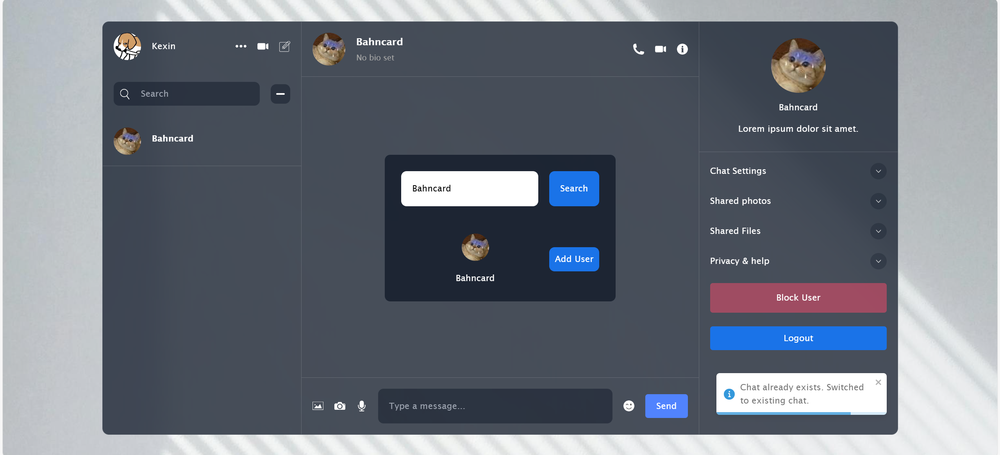
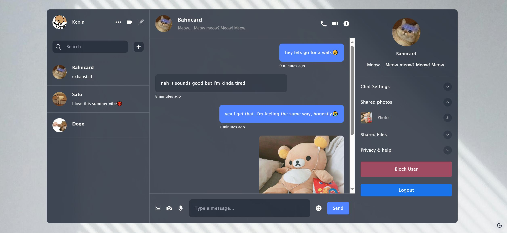
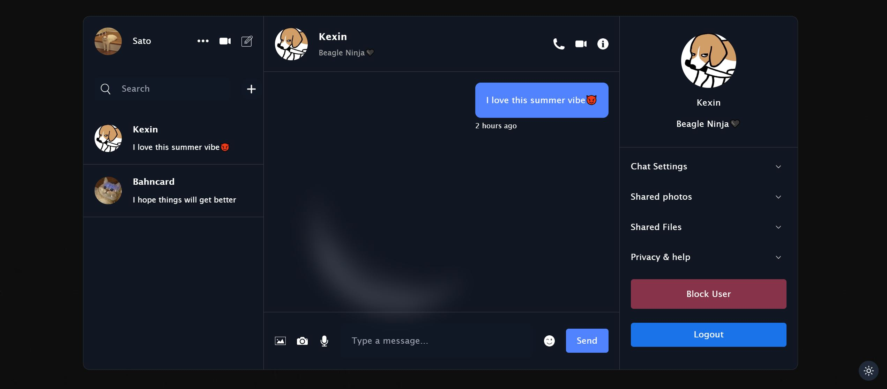
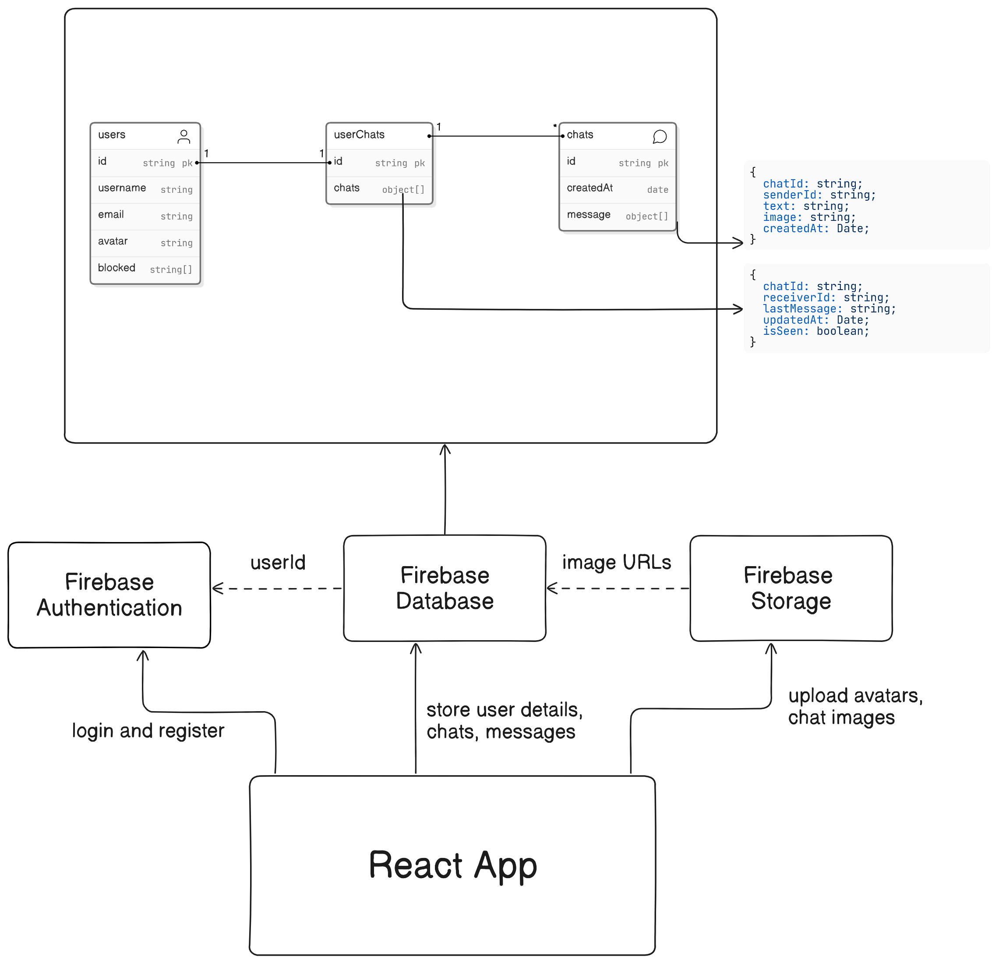

# EchoChat

## Introduction

EchoChat is a real-time messaging application built with React and Firebase.

## Features

- **User Authentication**: Register and log in with validation.
- **Friend Management**: Search for and add friends to your chat list.
- **Real-Time Chat**: Chat with friends, with timestamps for each message.
- **Chat Management**: Delete or prioritize chat windows.
- **Blacklist**: Block unwanted users by adding them to a blacklist.
- **User Profile**: Update your biography and other personal details.
- **Shared Media**: Share photos and files within chats.
- **Image Preview**: Open images in full-screen preview mode.
- **Theme Switcher**: Toggle between light and dark themes.

## Screenshots





## Live Demo

You can try out the live demo of the app [here](https://echo-chat-xi.vercel.app/)

## Architecture



## Technologies

#### Frontend

- React
- React Router
- Zustand
- React Toastify
- TailwindCSS
- Timeago.js
- Lucide React
- Emoji Picker React

#### Backend

- Firebase

#### Build & Development Tools

- Vite
- Vercel

## Getting Started

1. **Install Node.js and npm** if you haven't already.

2. **Create a `.env` file** in the root directory.

3. **Create a Firebase project**, and fill in the Firebase configuration in your `.env` file as follows:
   ```env
   VITE_API_KEY="your_api_key_here"
   VITE_AUTH_DOMAIN=
   VITE_PROJECT_ID=
   VITE_STORAGE_BUCKET=
   VITE_MESSAGING_SENDER_ID=
   VITE_APP_ID=
   ```
